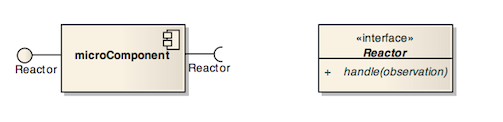
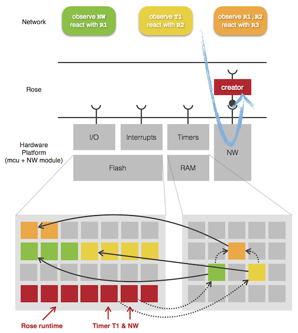

<h1>Rose, a Reactive Operating System Experiment</h1>

Christophe VG (<contact@christophe.vg>)  
[https://github.com/christophevg/rose](https://github.com/christophevg/rose)

## Introduction

Rose is a **R**eactive **O**perating **S**ystem **E**xperiment for networked embedded devices, typically with limited resources, think Wireless Sensor Networks or the Internet of Things.

The foundations of Rose lie in three separate concepts:

- Reactive Programming
- Component-based Development
- VM-based Operating Systems

### A Network of Observable Observers

Given a resource-constrained device, basically an micro-controller (mcu) and a networking module Rose adds a tiny layer wrapping all sources of events in `observable` entities: network messages, I/O pins, timers and interrupts. On top of that, one `observer` is added: the `creator`, aka the divine observer.

The creator observes network messages and if such a message contains the right information, it will use that information to instantiate a new observer. This elementary construction allows for the composition of a network of interconnected observers and observables, called the `dependency graph`, creating all together one or more applications.

It is important to understand that each observer is by design also observable. So it is perfectly possible to observe the creator and be notified of every new observer that is instantiated by the creator.

### &mu;Components

An observable observer, as introduced above, can in fact be considered a kind of very small and more technical component. It has a single interface for observation handling, called the `reactor` that is applicable to both the required and provided interface. This interface basically consists of a single function to handle an `observation`.

<p align="center"></p>

### A 1-on-1 OS API

Reactors need to be able to actually perform actions, like sending messages on the network, set an output pin,... So besides wrapping the underlying hardware and network in observable entities, Rose also provides an API to access the same underlying hardware. This API is simply a 1-on-1 mapping of functionality provided by the MCU.

Besides access to the underlying hardware, Rose also provides an API for managing the dependency graph. This graph is created when observers are instantiated. Using this API, rectors can change the layout of this graph. Needless to say, this can cause as much havoc as benefit. Don't shoot yourself in the foot. Rose might seem lovely and fragile, but it has many thorns ;-)

### More than a 1000 Words

Bringing all these concepts together in one picture, gives you a complete overview of Rose, its concepts and operational behavior:

<p align="center"></p>

In the middle is the actual device, the hardware platform, consisting of an mcu and a network module. The mcu itself contains flash memory or program memory, RAM, input/output pins, interrups and timers.

On top of this hardware platform, Rose constructs observables for all of its components. One observer is instantiated, the creator, observing the network.

At the top, three observers are defined, each observing one or more observables and reacting each with its own functionality.

At the bottom, both the program memory and the volatile RAM are depicted after the three observers have been added. Initially, the program memory only contained the Rose runtime and code representing e.g. Timer T1 and the network (NW). On each arrival of an observer, the creator allocates memory to store the information about the observer, hooking it up to the observed observable(s) (dependencies are shown using dashed arrows) and storing the binary code for the reactor in the program memory, providing a (function) pointer to it from the data structure in RAM (full arrows).

## Bootstrapping Rose

Because Rose is basically a minimal VM, we can explore Rose completely in code, without the need for an actual embedded system. This is also how Rose is developed. Once the basics are in place, the desktop-VM is ported to an AVR-target. This also means you have a nice virtual environment to develop on, again without the need to deploy to _real_ hardware.

### Step 1: Partial Image Updates

Typically a program is compiled and linked, stored on a medium and executed when requested by the user. If the final linking isn't part of the equation, an intermediate format can be used to hold all binary information, ready to be linked and executed on demand. Dynamic libraries are an example of this.

Let's introduce some code and see it in action.

#### mul.c

```c
int a() {
  return 21;
}

int b() {
  return 2;
}

int mul_a_b() {
  return a() * b();
}
```

#### main.c

```c
#include <stdio.h>

int mul_a_b(void); // forward declaration for our library

int main(void) {
  printf("%d\n", mul_a_b());
  return 0;
}
```

Building it into and using a dynamic library (on Mac OS X) looks like this:

```bash
$ clang -dynamiclib -o libmul.dylib mul.c
$ clang main.c -L. -lmul

$ ls -l
total 56
-rwxr-xr-x  1 xtof  staff  8600 Mar 11 13:15 a.out
-rwxr-xr-x  1 xtof  staff  4312 Mar 11 13:15 libmul.dylib
-rw-r--r--@ 1 xtof  staff   129 Mar 11 13:15 main.c
-rw-r--r--@ 1 xtof  staff    89 Mar 11 13:15 mul.c

$ ./a.out 
42
```

All nice and dandy, but 4KB for such a minimalistic library ?! :-(

But, you can strip the symbols...

```bash
$ strip libmul.dylib
$ ls -l libmul.dylib 
-rwxr-xr-x  1 xtof  staff  4216 Mar 11 13:17 libmul.dylib
```

Hmm, not the effect I hoped for. Let's take a step back ...

```bash
$ clang -o mul.o -c mul.c
$ ls -l mul.*
-rw-r--r--@ 1 xtof  staff   89 Mar 11 13:15 mul.c
-rw-r--r--  1 xtof  staff  964 Mar 11 13:24 mul.o
```

It seems that packaging the functionality in a dynamic library introduces quiet some overhead. But I still wouldn't expect the binary version of my library to be about 10x bigger than its source code example.

Let's see what's actually in their that might be of interest. Using `objdump` (part of `binutils`) we can show the actual bytes that are to be executed:

```bash
$ gobjdump -d mul.o

mul.o:     file format mach-o-x86-64

Disassembly of section .text:

0000000000000000 <_a>:
   0:	55                   	push   %rbp
   1:	48 89 e5             	mov    %rsp,%rbp
   4:	b8 15 00 00 00       	mov    $0x15,%eax
   9:	5d                   	pop    %rbp
   a:	c3                   	retq   
   b:	0f 1f 44 00 00       	nopl   0x0(%rax,%rax,1)

0000000000000010 <_b>:
  10:	55                   	push   %rbp
  11:	48 89 e5             	mov    %rsp,%rbp
  14:	b8 02 00 00 00       	mov    $0x2,%eax
  19:	5d                   	pop    %rbp
  1a:	c3                   	retq   
  1b:	0f 1f 44 00 00       	nopl   0x0(%rax,%rax,1)

0000000000000020 <_mul_a_b>:
  20:	55                   	push   %rbp
  21:	48 89 e5             	mov    %rsp,%rbp
  24:	48 83 ec 10          	sub    $0x10,%rsp
  28:	e8 00 00 00 00       	callq  2d <_mul_a_b+0xd>
  2d:	89 45 fc             	mov    %eax,-0x4(%rbp)
  30:	e8 00 00 00 00       	callq  35 <_mul_a_b+0x15>
  35:	8b 4d fc             	mov    -0x4(%rbp),%ecx
  38:	0f af c8             	imul   %eax,%ecx
  3b:	89 c8                	mov    %ecx,%eax
  3d:	48 83 c4 10          	add    $0x10,%rsp
  41:	5d                   	pop    %rbp
  42:	c3                   	retq   
```

This shows that the actual payload is merely 66 (0x42) bytes. Now that's more like it. So where's the catch?

The catch is in the `callq` instruction. As this code isn't linked yet, the address to call/jump to still points to `00 00 00 00`, which is in fact the relative position with the next operation as a reference point. The linker will fill out the actual displacement...

```bash
$ clang -o main.o -c main.c
$ clang mul.o main.o
$ gobjdump -d a.out -j .text

a.out:     file format mach-o-x86-64

Disassembly of section .text:

0000000100000ed0 <_a>:
   100000ed0:	55                   	push   %rbp
   100000ed1:	48 89 e5             	mov    %rsp,%rbp
   100000ed4:	b8 15 00 00 00       	mov    $0x15,%eax
   100000ed9:	5d                   	pop    %rbp
   100000eda:	c3                   	retq   
   100000edb:	0f 1f 44 00 00       	nopl   0x0(%rax,%rax,1)

0000000100000ee0 <_b>:
   100000ee0:	55                   	push   %rbp
   100000ee1:	48 89 e5             	mov    %rsp,%rbp
   100000ee4:	b8 02 00 00 00       	mov    $0x2,%eax
   100000ee9:	5d                   	pop    %rbp
   100000eea:	c3                   	retq   
   100000eeb:	0f 1f 44 00 00       	nopl   0x0(%rax,%rax,1)

0000000100000ef0 <_mul_a_b>:
   100000ef0:	55                   	push   %rbp
   100000ef1:	48 89 e5             	mov    %rsp,%rbp
   100000ef4:	48 83 ec 10          	sub    $0x10,%rsp
   100000ef8:	e8 d3 ff ff ff       	callq  100000ed0 <_a>
   100000efd:	89 45 fc             	mov    %eax,-0x4(%rbp)
   100000f00:	e8 db ff ff ff       	callq  100000ee0 <_b>
   100000f05:	8b 4d fc             	mov    -0x4(%rbp),%ecx
   100000f08:	0f af c8             	imul   %eax,%ecx
   100000f0b:	89 c8                	mov    %ecx,%eax
   100000f0d:	48 83 c4 10          	add    $0x10,%rsp
   100000f11:	5d                   	pop    %rbp
   100000f12:	c3                   	retq   
...
```

Now we see that the linker indeed has replaced the empty address with the address of functions `_a` and `_b`, respectively `100000ed0` and `100000ee0`. The actual bytes encoding the displacements to these addresses are `d3 ff ff ff` and `db ff ff ff`. Note that the address is formatted in little endian, so with the least significant byte (LSB) first.

```python
$ python
>>> 0x100000ed0 - 0x100000efd
-45
>>> import struct
>>> struct.pack("<i", -45).encode('hex')
'd3ffffff'
```

The information where the call should jump to is also stored in the (not-yet-linked) library:

```bash
$ gobjdump -r mul.o -j .text

mul.o:     file format mach-o-x86-64

RELOCATION RECORDS FOR [.text]:
OFFSET           TYPE              VALUE 
0000000000000031 BRANCH32          _b
0000000000000029 BRANCH32          _a
```

This information tells the linker that at offsets `29` and `31` in the compiled code, a relative address should be written pointing to where `_a` and `_b` are located.

#### Executing Dynamically Created Instructions

Let's see how we can apply this new-found knowledge...

##### function.c

```c
int function() {
  return 42;
}
```

Compile and inspect the byte code.

```bash
$ clang -fomit-frame-pointer -o function.o -c function.c
$ gobjdump -d function.o

function.o:     file format mach-o-x86-64

Disassembly of section .text:

0000000000000000 <_function>:
   0:	b8 2a 00 00 00       	mov    $0x2a,%eax
   5:	c3                   	retq
```

##### call.c

Taking the 6 bytes implementing `function`, we now create a program that dynamically allocates a block of memory, stores the 6 bytes in it and calls a pointer pointing to this block.

```c
#include <stdio.h>
#include <stdint.h>
#include <string.h>
#include <sys/mman.h>

uint8_t* create_function(int size, const uint8_t* bytes) {
  // On Mac OS X and other BSD-based UNIX derivatives,
  // "MAP_ANONYMOUS" is called "MAP_ANON".
  uint8_t *buf = mmap(NULL, size,
                      PROT_EXEC | PROT_READ | PROT_WRITE,
                      MAP_PRIVATE | MAP_ANON, -1, 0);
  memcpy(buf, bytes, size);
  return buf;
}

int main(int argc, char *argv[]) {
  int (*f)(void) =
    (int (*)(void)) create_function(6,
      (uint8_t[6]) { 0xb8, 0x2a, 0x00, 0x00, 0x00, 0xc3 }
    );
  
  printf("return is %d\n", f());
  return 0;
}
```

And this _is_ actually executable...

```bash
$ clang main.c
$ ./a.out 
return is 42
```

#### Towards a VM-like Environment

The previous example was rather easy, mainly due to the absence of function calls. Although we saw that computing the relative addresses is rather easy, it still is tedious. So I wrote `ObjectDump.py`, a small module to automate this.

Equipped with this tool and an interactive `create_function` function, we're all set to add multiple, dependant functions and execute them:

##### vm.c

```c
#include <stdio.h>
#include <stdint.h>
#include <string.h>
#include <sys/mman.h>

uint8_t* create_function(char* name) {
  int size, in;
  
  printf("size %s = ", name);
  scanf("%d", &size);
  uint8_t *buf = mmap(NULL, size, PROT_EXEC | PROT_READ | PROT_WRITE,
                                  MAP_PRIVATE | MAP_ANON, -1, 0);
  printf("buffer for %s starts at %p\n", name, buf);
  for(int i=0; i<size; i++) {
    scanf("%x", &in);
    buf[i] = (uint8_t)in;
  }
  return buf;
}

int main(int argc, char *argv[]) {
  int (*f_a)(void)       = (int (*)(void)) create_function("a");
  printf("return of a is %d\n", f_a());

  int (*f_b)(void)       = (int (*)(void)) create_function("b");
  printf("return of b is %d\n", f_b());
  
  int (*f_mul_a_b)(void) = (int (*)(void)) create_function("mul_a_b");
  printf("return of mu_a_b is %d\n", f_mul_a_b());

  return 0;
}
```

##### Introducing ObjectDump.py

```bash
$ ./ObjectDump.py -h
usage: ObjectDump.py [-h] [-v] [-l] [-n] [-s] [-p] [-c] [-f FUNCTION]
                     [-r RELOCATE]
                     [files [files ...]]

Command-line tool to query and relocate object files.

positional arguments:
  files                 object files to be loaded.

optional arguments:
  -h, --help            show this help message and exit
  -v, --verbose         output info on what's happening
  -l, --list            list all loaded functions
  -n, --name            show name of function (in combination with -f or -l)
  -s, --size            show size of code. in combination with -f or -l for
                        each function
  -p, --position        show position of code (in combination with -f or -l)
  -c, --code            show code. in combination with -f for each function
  -f FUNCTION, --function FUNCTION
                        show information for this function
  -r RELOCATE, --relocate RELOCATE
                        relocate a function. argument format: <name>:<hex-
                        address
```

##### Investigating the Object File

We first compile the library with function. We can use `ObjectDump.py` to gather information about the functions included and their size:

```bash
$ clang -c mul.c -o mul.o
$ ./ObjectDump.py mul.o -l -n -s
a 16
b 16
mul_a_b 35
```
##### Running our _&mu;_VM

We can now start the actual program...

```bash
$ clang vm.c
$ ./a.out 
size a = 16
buffer for a starts at 0x104a42000
```

The VM now waits for some (16) bytes. Given the location for `a` we can use `ObjectDump.py` to compute its code:

```bash
$ ./ObjectDump.py mul.o -r a:0x104a42000 -f a -c
55 48 89 e5 b8 15 00 00 00 5d c3 0f 1f 44 00 00
```

Copy paste and continue with the actual program, entering the bytes:

```bash
55 48 89 e5 b8 15 00 00 00 5d c3 0f 1f 44 00 00
return of a is 21
size b = 16
buffer for b starts at 0x104a43000
```

Compute `b`'s code:

```bash
$ ./ObjectDump.py mul.o -r a:0x104a42000 -r b:0x104a43000 -f b -c
55 48 89 e5 b8 02 00 00 00 5d c3 0f 1f 44 00 00
```

And continue ...

```bash
55 48 89 e5 b8 02 00 00 00 5d c3 0f 1f 44 00 00
return of b is 2
size mul_a_b = 35
buffer for mul_a_b starts at 0x104a44000
```

And finally compute `mul_a_b`'s code:

```bash
$ ./ObjectDump.py mul.o -r a:0x104a42000 -r b:0x104a43000 -r mul_a_b:0x104a44000 -f mul_a_b -c
55 48 89 e5 48 83 ec 10 e8 f3 df ff ff 89 45 fc e8 eb ef ff ff 8b 4d fc 0f af c8 89 c8 48 83 c4 10 5d c3
```

Et voila ...

```bash
55 48 89 e5 48 83 ec 10 e8 f3 df ff ff 89 45 fc e8 eb ef ff ff 8b 4d fc 0f af c8 89 c8 48 83 c4 10 5d c3
return of mu_a_b is 42
```

Although embryonal in its current form, it shows that the idea is technically feasible. Now remember our dynamic library from earlier? A stripped version `libmul.dylib` consisted of 4216 bytes. Given a platform that accepts shared libraries (typically using an ELF-loader), one can send this library and use it.

Now consider that we can achieve the same using 16 bytes for `a`, 16 bytes for `b` and 35 bytes for `mul_a_b`, or 67 bytes in total, managing the linking of the functions at management station and constructing the running image remotely using micro-updates, results in a reduction in network traffic (for programming) of 98% :-)

### Step 2: Abandon the Mach-O ship

I was optimistic to first implement everything on my MacBook, but at this point, I have to abandon that route, simply because it would be too costly to first develop the entire solution based on its runtime architecture, most notably due to dynamic linking.

When compiling an example which uses for example `printf`, on Mac the resulting executable will contain logic to call out to the `dyld_stub_binder` and `_helper`, which its turn will look up the dynamic library and call out to it.

```
0000000100000e60 <_p>:
   100000e60:	50                   	push   %rax
   100000e61:	e8 ba ff ff ff       	callq  100000e20 <_a>
   100000e66:	48 8d 3d 3f 00 00 00 	lea    0x3f(%rip),%rdi        # 100000eac <_printf$stub+0x2a>
   100000e6d:	89 c6                	mov    %eax,%esi
   100000e6f:	b0 00                	mov    $0x0,%al
   100000e71:	e8 0c 00 00 00       	callq  100000e82 <_printf$stub>
   100000e76:	89 44 24 04          	mov    %eax,0x4(%rsp)
   100000e7a:	58                   	pop    %rax
   100000e7b:	c3                   	retq   
...
0000000100000e82 <_printf$stub>:
   100000e82:	ff 25 90 01 00 00    	jmpq   *0x190(%rip)        # 100001018 <_printf$stub>
...
0000000100000e88 <__TEXT.__stub_helper>:
   100000e88:	4c 8d 1d 79 01 00 00 	lea    0x179(%rip),%r11        # 100001008 <>
   100000e8f:	41 53                	push   %r11
   100000e91:	ff 25 69 01 00 00    	jmpq   *0x169(%rip)        # 100001000 <dyld_stub_binder$stub>
   100000e97:	90                   	nop
   100000e98:	68 00 00 00 00       	pushq  $0x0
   100000e9d:	e9 e6 ff ff ff       	jmpq   100000e88 <_printf$stub+0x6>
   100000ea2:	68 0c 00 00 00       	pushq  $0xc
   100000ea7:	e9 dc ff ff ff       	jmpq   100000e88 <_printf$stub+0x6>
...
```
If you're interested in more, I recommend [http://newosxbook.com/articles/DYLD.html](http://newosxbook.com/articles/DYLD.html).

When compiling using `avr-gcc`, the resulting binary is self-contained. It's an image that contains everything, and therefore also the `printf` code. Extracting everything from such a file is much easier, and I'll switch to this platform now to implement the solution directly for it.

## Bootstrapping Rose - Revisited

_To be continued..._

## Rose Examples

The remainder of this document will introduce Rose by means of examples. This will allow you to get a feeling of developing applications using Rose.

### Hello Blink

Every project should have a hello world example ... In embedded systems, the typical hello world example is the blinking LED. Let's implement it using Rose.

_To be continued..._
