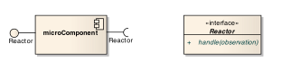
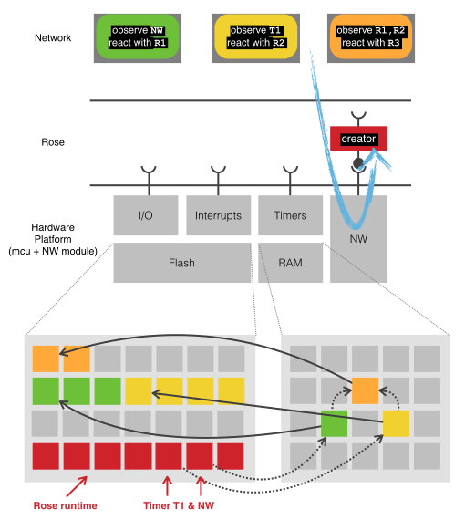

# Rose, a Reactive Operating System Experiment

Christophe VG (<contact@christophe.vg>)  
[https://github.com/christophevg/rose](https://github.com/christophevg/rose)

## Introduction

Rose is a **R**eactive **O**perating **S**ystem **E**xperiment for networked embedded devices, typically with limited resources, think Wireless Sensor Networks or the Internet of Things.

The foundations of Rose lie in three separate concepts:

- Reactive Programming
- Component-based Development
- VM-based Operating Systems

### A Network of Observable Observers

Given a resource-constrained device, basically an micro-controller (mcu) and a networking module Rose adds a tiny layer wrapping all sources of events in `observable` entities: network messages, I/O pins, timers and interrupts. On top of that, one `observer` is added: the `creator`, aka the divine observer.

The creator observes network messages and if such a message contains the right information, it will use that information to instantiate a new observer. This elementary construction allows for the composition of a network of interconnected observers and observables, called the `dependency graph`, creating all together one or more applications.

It is important to understand that each observer is by design also observable. So it is perfectly possible to observe the creator and be notified of every new observer that is instantiated by the creator.

### &mu;Components

An observable observer, as introduced above, can in fact be considered a kind of very small and more technical component. It has a single interface for observation handling, called the `reactor` that is applicable to both the required and provided interface. This interface basically consists of a single function to handle an `observation`.

### A 1-on-1 OS API

Reactors need to be able to actually perform actions, like sending messages on the network, set an output pin,... So besides wrapping the underlying hardware and network in observable entities, Rose also provides an API to access the same underlying hardware. This API is simply a 1-on-1 mapping of functionality provided by the MCU.

Besides access to the underlying hardware, Rose also provides an API for managing the dependency graph. This graph is created when observers are instantiated. Using this API, rectors can change the layout of this graph. Needless to say, this can cause as much havoc as benefit. Don't shoot yourself in the foot. Rose might seem lovely and fragile, but it has many thorns ;-)

### More than a 1000 Words

Bringing all these concepts together in one picture, gives you a complete overview of Rose, its concepts and operational behavior:

In the middle is the actual device, the hardware platform, consisting of an mcu and a network module. The mcu itself contains flash memory or program memory, RAM, input/output pins, interrups and timers.

On top of this hardware platform, Rose constructs observables for all of its components. One observer is instantiated, the creator, observing the network.

At the top, three observers are defined, each observing one or more observables and reacting each with its own functionality.

At the bottom, both the program memory and the volatile RAM are depicted after the three observers have been added. Initially, the program memory only contained the Rose runtime and code representing e.g. Timer T1 and the network (NW). On each arrival of an observer, the creator allocates memory to store the information about the observer, hooking it up to the observed observable(s) (dependencies are shown using dashed arrows) and storing the binary code for the reactor in the program memory, providing a (function) pointer to it from the data structure in RAM (full arrows).

## Rose Examples

The remainder of this document will introduce Rose by means of examples. This will allow you to get a feeling of developing applications using Rose.

### Hello Blink

Every project should have a hello world example ... In embedded systems, the typical hello world example is the blinking LED. Let's implement it using Rose.

_To be continued..._
